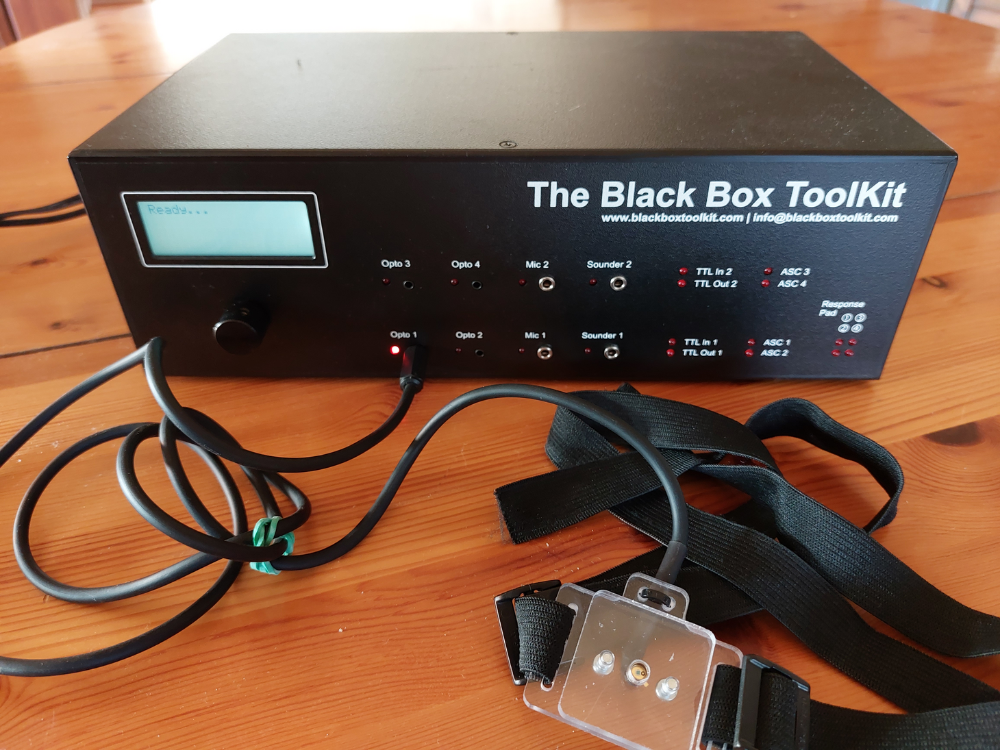
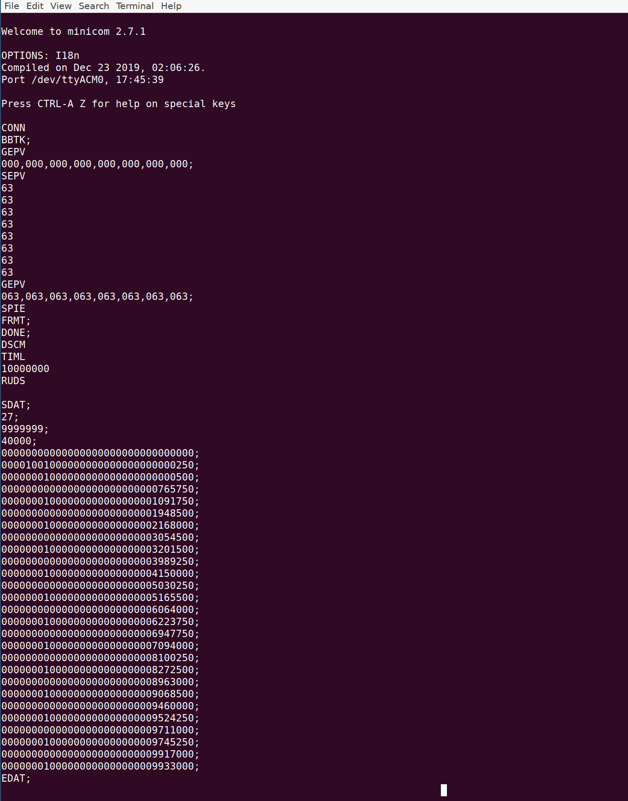

The [BlackBox ToolKit v2](https://www.blackboxtoolkit.com/bbtkv2.html) is a device that allows psychologists to accuretly measure the timing of stimulation.

It communicates via a serial protocol over USB, using commands described in the _API Guide_ sold with the box. 

This allows users to control the BBTKv2 without the Windows software provided by the parent company.

In particular, it is possible to control the BBTKv2 using Python, under Linux or MacOSX, using the [pyserial module](https://pyserial.rtfd.io)

That is the aim of the bbtkv2.py module provided here. 

Before using it, we recommend to check the communication between the BBTKv2 and the PC using a serial communication program.

# Checking the connection to the BBTK v2

(These instructions are specific to Linux)

0. Install the Minicom serial communication program

         sudo apt install minicom

1. Power on the Bbtk_v2, then link it through USB cable to your computer

   A usb-storage device `BBTKV2` should be detected and mounted, and a USB ACM device `/dev/ttyACM0`  should have been created.

    Determine the Baud Rate:

        cat /media/*/BBTKV2/BBTK.ini 
        [BaudRate]
        230400

2. Launch Minicom:

	minicom -8 -D /dev/ttyACM0 -b 230400

   The terminal should display:
  
        Welcome to minicom 2.7.1                                                                             
                                                                                                     
        OPTIONS: I18n                                                                                        
        Compiled on Dec 23 2019, 02:06:26.                                                                   
        Port /dev/ttyACM0, 17:31:53                                                                          
                                                                                                     
        Press CTRL-A Z for help on special keys                                                              
 

   Press `CTRL-A Z` and select `Local Echo 'on'`, and `Add Carriage Ret`, and `Send a Break`

3. Run a short acquisition session:

  * Send the command ``CONN``. In return, you should get the messgge ``BBTK;``

  *  Enter the command GEPV read the sensors' thresholds.

  *  Enter ``SEPV`` and 8 times ``63`` to set the sensors' thresholds

  *  Enter ``SPIE`` to erase internal memory. Check the display of the Bbtkv2.

  *  Enter ``ICHK`` and create events  (e.g. putting a light on/off on a photodetector), each event should generate the display of a line with 12 binary digits. Send a Break `CTRL-A Z F` to interupt the process;

  * To capture events for 10s:
  
      DSCM
      TIML
      10000000
      RUDS

   

   The information about the events is provided in the `SDAT;` and `EDAT;` lines.
   The lines containing 32 digits encode the events in the following manner: the first 12 digits reprenet the status of input ports, the next 8 digits describe the ouput ports (and should all be zero with the DSC command), and the last 12 digits indicate the time in microseconds since the start of the acquisition run.

